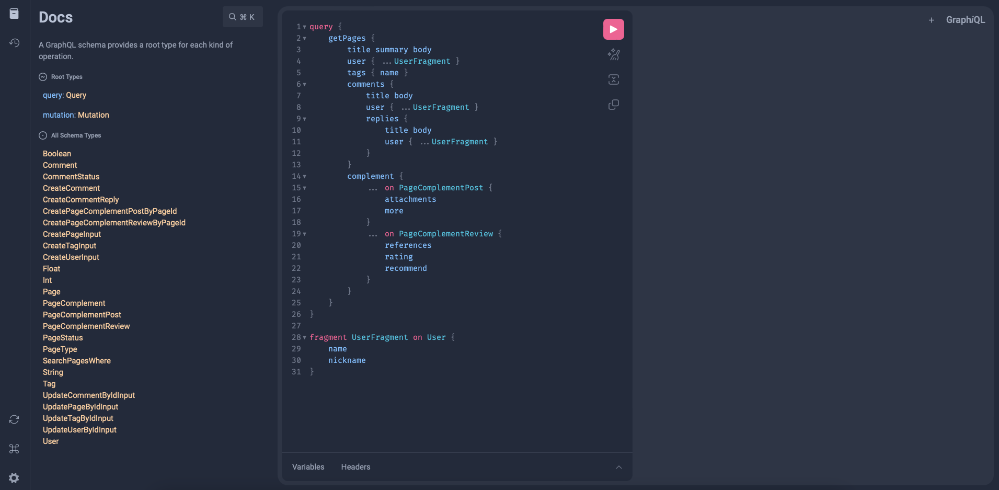
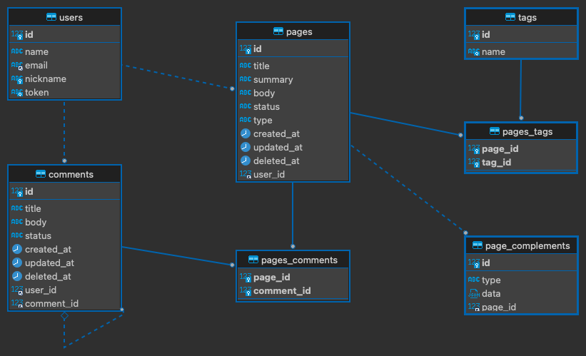
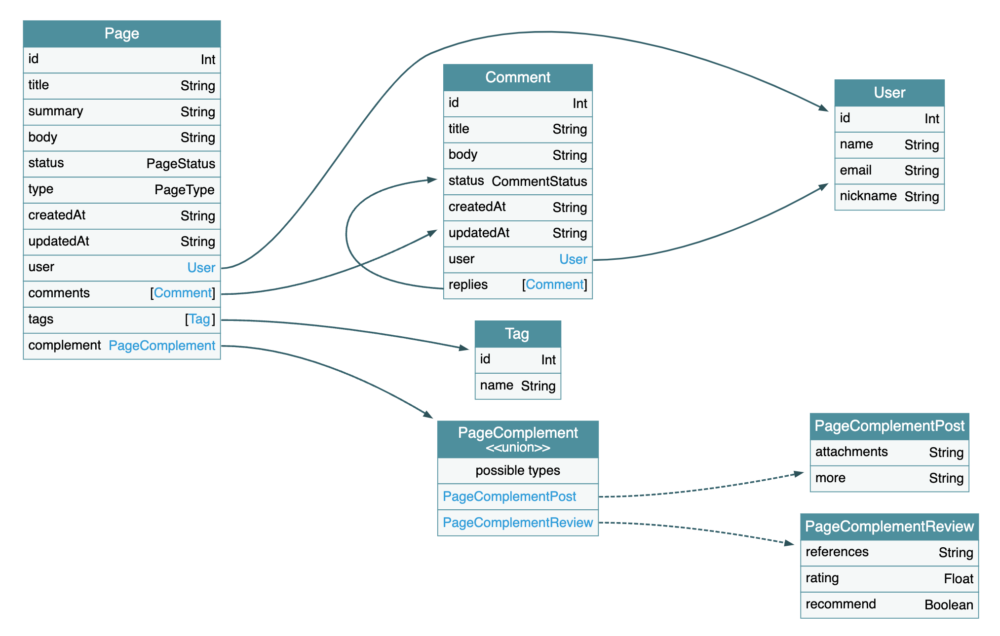

<div align="center">
    
    <h1>Playground | CMS - Content Management System</h1>
    <h4>Made with <a href="https://graphql.org" target="_blank">GraphQL</a> and <a href="https://kotlinlang.org" target="_blank">Kotlin</a> 🚀</h4>
    <br />
</div>

> This application was developed as a basis for studying Spring Boot GraphQL and Kotlin. Some decisions were based on educational purposes only.

The application simulates the basics of a Content Management System, where it is possible to create users, content pages, associate pages with tags to group similar contents, create comments for pages and reply to comments.

## Technologies

The main technologies used in the project:

- Docker / Compose
- Gradle
- Kotlin 1.7.x
- Spring Boot 3.x
- Spring Boot GraphQL
- FlyWay

### Install Dependencies

```shell
./gradlew clean install
```

### Running Application

Start docker compose for initialize database:

```shell
docker-compose up -d
```

Start gradle application:

```shell
./gradlew bootRun
```

## Localhost

Access the URL below to access the GraphiQL Playground.

`http://localhost:8080/graphiql`



Add the query below to execute your first request:

```graphql
{
    getPages {
        title summary body
        user { name nickname }
        tags { name }
        comments {
            title body
            user { name nickname }
            replies {
                title body
                user { name nickname }
            }
        }
    }
}
```

## Database Diagram



## GraphQL Diagram

### Types Diagram



### Queries Diagram


### Mutations Diagram


## Users

```graphql
type User {
    id: Int
    name: String
    email: String
    nickname: String
}
```

### Queries

```graphql
type Query {
    getUsers(page: Int = 1, size: Int = 10): [User]!
    getUserById(id: Int!): User
    getUserByNickname(nickname: String!): User
    getUserToken(nickname: String!, email: String!): String!
}
```

### Mutations

```graphql
type Mutation {
    createUser(input: CreateUserInput!): User!
    updateUserById(id: Int!, input: UpdateUserByIdInput!): User!
    deleteUserById(id: Int!): Boolean!
}

input CreateUserInput {
    name: String!
    email: String!
    nickname: String!
}

input UpdateUserByIdInput {
    name: String
    email: String
}
```

## Pages

```graphql
type Page {
    id: Int
    title: String
    summary: String
    body: String
    status: PageStatus
    createdAt: String
    updatedAt: String
    user: User
    comments(page: Int = 1, size: Int = 10): [Comment]
    tags: [Tag]
}

enum PageStatus {
    DRAFT
    PUBLISHED
    HIDDEN
    DELETED
}
```

### Queries

```graphql
type Query {
    getPages(page: Int = 1, size: Int = 10): [Page]
    getPagesByUserId(userId: Int!, page: Int = 1, size: Int = 10): [Page]
    getPagesByTagId(tagId: Int!, page: Int = 1, size: Int = 10): [Page]
    searchPages(where: SearchPagesWhere!, page: Int = 1, size: Int = 10): [Page]
    getPageById(id: Int!): Page
}

input SearchPagesWhere {
    userNickname: String
    userEmail: String
    tagName: String
}
```

### Mutations

```graphql
type Mutation {
    createPage(input: CreatePageInput!): Page!
    updatePageById(id: Int!, input: UpdatePageByIdInput!): Page!
    deletePageById(id: Int!): Boolean!
}

input CreatePageInput {
    title: String!
    summary: String
    body: String!
    status: PageStatus
    tagIds: [Int!]
}

input UpdatePageByIdInput {
    summary: String
    body: String
    status: PageStatus
}
```

> Note: To create Page it is necessary to inform the header: `x-user-token`.

## Comments

```graphql
type Comment {
    id: Int
    title: String
    body: String
    status: CommentStatus
    createdAt: String
    updatedAt: String
    user: User
    replies(page: Int = 1, size: Int = 10): [Comment]
}

enum CommentStatus {
    ACTIVATED
    MODERATED
    DELETED
}
```

### Queries

```graphql
type Query {
    getCommentsByUserId(userId: Int!, page: Int = 1, size: Int = 10): [Comment]!
    getCommentById(id: Int!): Comment
}
```

### Mutations

```graphql
type Mutation {
    createComment(input: CreateComment!): Comment!
    createCommentReply(input: CreateCommentReply!): Comment!
    updateCommentById(id: Int!, input: UpdateCommentByIdInput!): Comment!
    deleteCommentById(id: Int!): Boolean!
}

input CreateComment {
    pageId: Int!
    title: String!
    body: String
}

input CreateCommentReply {
    commentId: Int!
    title: String!
    body: String
}

input UpdateCommentByIdInput {
    title: String
    body: String
}
```

> Note: To create Comment it is necessary to inform the header: `x-user-token`.

## Tags

```graphql
type Tag {
    id: Int
    name: String
}
```

### Queries

```graphql
type Query {
    getTags(page: Int = 1, size: Int = 10): [Tag]!
    getTagById(id: Int): Tag
}
```

### Mutations

```graphql
type Mutation {
    createTag(input: CreateTagInput!): Tag!
    updateTagById(id: Int!, input: UpdateTagByIdInput!): Tag!
    deleteTagById(id: Int!): Boolean!
}

input CreateTagInput {
    name: String!
}

input UpdateTagByIdInput {
    name: String!
}
```
